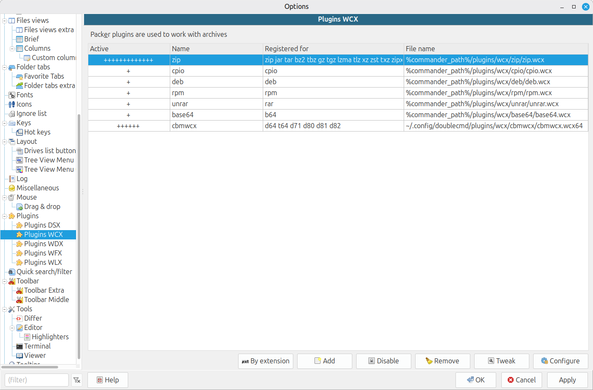
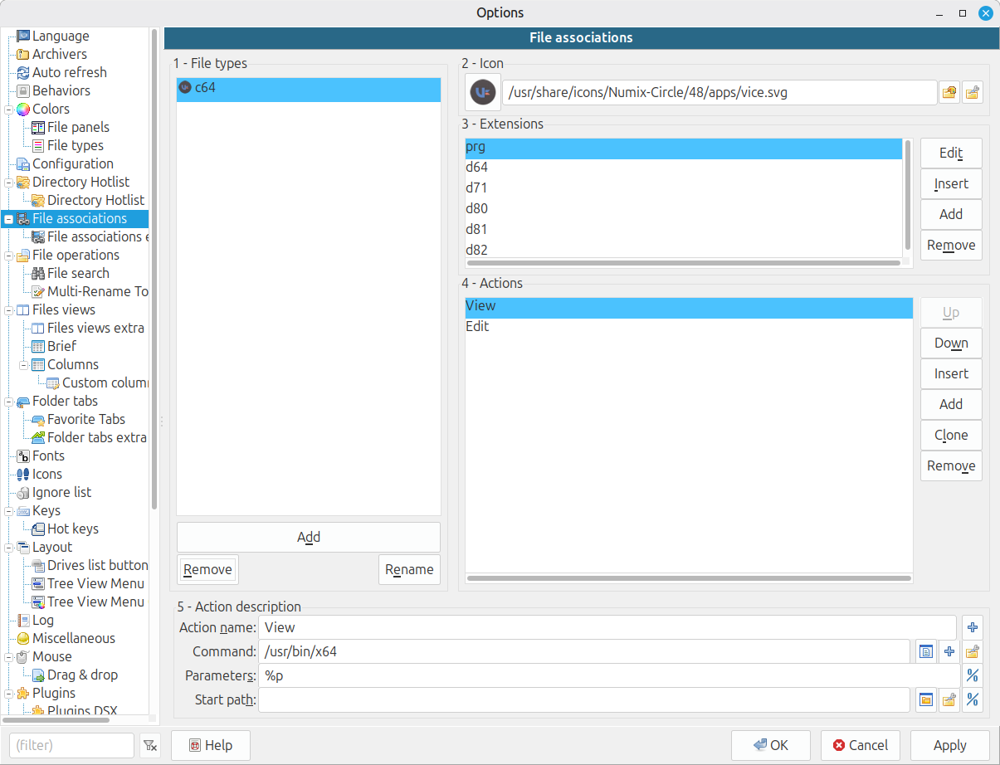
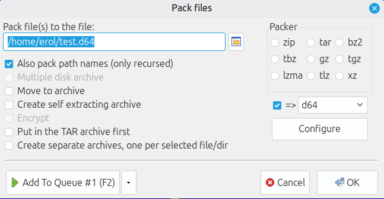

# cbmwcx

A WCX packer plugin for [Double Commander](https://doublecmd.sourceforge.io/) on Linux that lets you browse, extract, create, and delete files inside Commodore disk and tape images.

## Supported formats

| Extension | Format | Description |
|-----------|--------|-------------|
| `.d64` | D64 | C64 1541 disk image (35 or 40 tracks) |
| `.d71` | D71 | C64 1571 disk image (double-sided, 70 tracks) |
| `.d80` | D80 | CBM 8050 disk image (77 tracks) |
| `.d81` | D81 | C64 1581 disk image (80 tracks) |
| `.d82` | D82 | CBM 8250 disk image (154 tracks) |
| `.t64` | T64 | C64 tape image (read-only) |

## Features

- Browse directory listings inside disk images
- Extract files to the host filesystem
- Add files to existing disk images
- Create new blank disk images
- Delete files from disk images
- PETSCII ↔ UTF-8 filename conversion
- Optionally show scratched (deleted) files
- Configurable via `cbmwcx.ini`

## Requirements

- Linux x86-64
- Double Commander (tested with v1.1.11)
- GCC, make

## Build

```bash
make
```

The plugin is built as `cbmwcx.so`. For Double Commander on 64-bit Linux, rename it to `cbmwcx.wcx64`:

```bash
cp cbmwcx.so cbmwcx.wcx64
```

## Installation

1. Copy `cbmwcx.wcx64` and `cbmwcx.ini` to a directory of your choice (e.g. `~/.config/doublecmd/plugins/wcx/cbmwcx/`).
2. In Double Commander: **Options → Plugins → WCX plugins → Add**
3. Select the plugin file and add the extensions: `d64 d71 d80 d81 d82 t64`

## Configuration

Edit `cbmwcx.ini` next to the plugin file:

```ini
[common]
; log level: 0=off, 1=errors, 2=errors+warnings, 3=info, 4=verbose
logLevel=0

; show scratched (deleted) files
showScratchedFiles=0

; show ONLY scratched files
showONLYScratchedFiles=0

; always append .prg extension to all files
appendPrgExtension=0

; ignore error codes from error table
ignoreErrorTable=0

; fill deleted file sectors with 0x00 on delete
eraseDeletedSectors=0
```

## Screenshots







## Usage

### Creating a new disk image

Press **Alt+F5** in Double Commander to open the pack dialog. Enter a filename with one of the supported extensions (e.g. `mydisk.d64`) and the plugin will create a new blank disk image of the corresponding type.

## Notes

- T64 tape images are read-only (the format does not support writes)
- Disk image format is detected by file size and extension
- File type is inferred from extension on write: `.prg`, `.seq`, `.usr`, `.rel` (default: `.prg`)
- This is a Linux-native reimplementation; it is not related to the Windows-only `dircbm.wcx64` plugin
