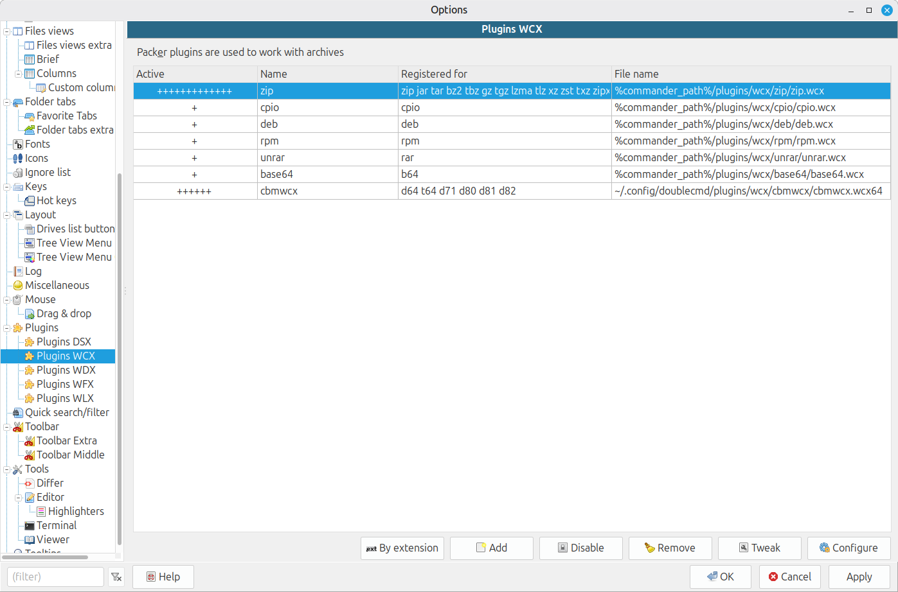
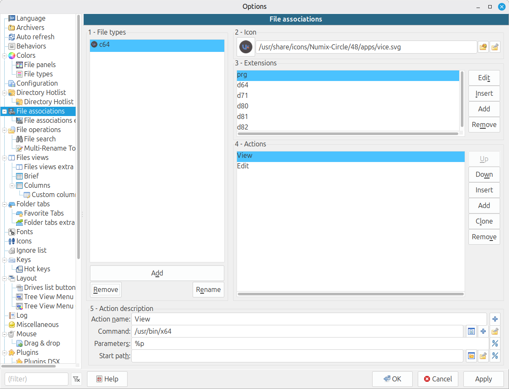
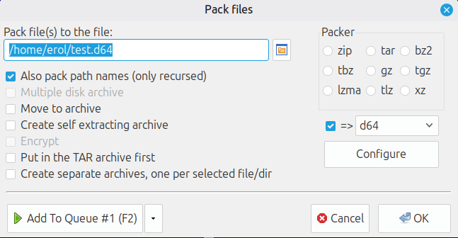

# cbmwcx

Current version: **v0.1.2**.

A WCX packer plugin for [Double Commander](https://doublecmd.sourceforge.io/) on Linux that lets you browse, extract, create, and delete files inside Commodore disk and tape images.

## Supported formats

| Extension | Format | Description |
|-----------|--------|-------------|
| `.d64` | D64 | C64 1541 disk image (35 or 40 tracks) |
| `.d71` | D71 | C64 1571 disk image (double-sided, 70 tracks) |
| `.d80` | D80 | CBM 8050 disk image (77 tracks) |
| `.d81` | D81 | C64 1581 disk image (80 tracks) |
| `.d82` | D82 | CBM 8250 disk image (154 tracks) |
| `.t64` | T64 | C64 tape image (read-only) |

## Features

- Browse directory listings inside disk images
- Extract files to the host filesystem
- Add files to existing disk images
- Create new blank disk images
- Delete files from disk images
- PETSCII ↔ UTF-8 filename conversion
- Optionally show scratched (deleted) files
- Configurable via `cbmwcx.ini`

## Requirements

- Linux x86-64
- Double Commander (tested with v1.1.11)
- GCC, make

## Build

```bash
make
```

The plugin is built as `cbmwcx.so`. For Double Commander on 64-bit Linux, rename it to `cbmwcx.wcx64`:

```bash
cp cbmwcx.so cbmwcx.wcx64
```

## Installation

1. Copy `cbmwcx.wcx64` and `cbmwcx.ini` to a directory of your choice (e.g. `~/.config/doublecmd/plugins/wcx/cbmwcx/`).
2. In Double Commander: **Options → Plugins → WCX plugins → Add**
3. Select the plugin file and add the extensions: `d64 d71 d80 d81 d82 t64`

## Configuration

Edit `cbmwcx.ini` next to the plugin file:

```ini
[common]
; log level: 0=off, 1=errors, 2=errors+warnings, 3=info, 4=verbose
logLevel=0

; 0=legacy ASCII, 1=Unicode, 2=Style64 C64 font
petsciiMode=1

; 0=uppercase/graphics, 1=lowercase/uppercase
petsciiLowercase=0

; show scratched (deleted) files
showScratchedFiles=0

; show ONLY scratched files
showONLYScratchedFiles=0

; show disk directory block counts in the Size column (listing only)
showFileSizeInBlocks=0

; show a read-only free-block information row in D64 listings
showFreeBlocks=0

; always append .prg extension to all files
appendPrgExtension=0

; ignore error codes from error table
ignoreErrorTable=0

; fill deleted file sectors with 0x00 on delete
eraseDeletedSectors=0
```

Active DEL files appear as ordinary `.del` files without enabling scratched files.
`showONLYScratchedFiles=1` filters out all active files, including DEL files.
Named scratched entries are shown as hidden `.del` files when enabled; unused
directory slots are omitted. Adding files preserves active DEL entries.

### File sizes in Commodore blocks

Set `showFileSizeInBlocks=1` in the INI file next to the loaded plugin and restart
Double Commander to show the stored directory block count in the Size column
for disk images (D64, D71, D80, D81 and D82). The default `0` reports actual byte
lengths. Counts come directly from directory entries, including zero-block DEL
entries, rather than being estimated from byte lengths. T64 stays in bytes.

This is an opt-in presentation workaround: WCX has no unit-label field, so
Double Commander still treats the displayed number as a byte size and may add
byte/KB suffixes, scale it, or use it in totals and progress estimates. Use its
byte-size display format to see the raw count. Extraction-mode headers and
extracted file contents keep their actual byte lengths. The plugin cannot
rename the Size column to Blocks or change the host's unit formatting.

### Free blocks in D64 images

Set `showFreeBlocks=1` to include a read-only information row such as
`[664 blocks free]` when browsing a D64. This is a virtual row, not a file stored
in the image: it has zero size, cannot be extracted, and is omitted when the
archive is opened for extraction. Selecting it along with actual files for
extraction may cause Double Commander to report an unsupported-operation error;
select only actual files. It cannot change the host's free-space footer.
Double Commander sorts this row with the other entries; the plugin cannot pin
it to the bottom of the listing.

The count uses standard 1541 BAM counters, excluding directory track 18, and
updates when you reopen/refresh the archive after adding or deleting files.
40-track images report only tracks 1-35 and say so in the row, since extended
BAM layouts vary. Invalid counters display `[free blocks unavailable]`.
Other disk formats and T64 do not display this row. Default: `showFreeBlocks=0`.

### PETSCII directory graphics

The plugin displays PETSCII names through its Unicode WCX interface. Set these
options in `cbmwcx.ini` next to the loaded plugin, then restart Double Commander:

| Option | Display |
|--------|---------|
| `petsciiMode=0` | Previous ASCII conversion, with graphics replaced by `_` |
| `petsciiMode=1` | Unicode letters, arrows, suits, blocks and line graphics (default) |
| `petsciiMode=2` | Style64 direct PETSCII glyph mapping for faithful C64 shapes |

Mode 1 works with fonts containing the relevant Unicode symbols. Shapes without
an entry in the plugin's standard Unicode table fall back to Style64 private-use
characters, so a compatible font is needed for those shapes. Mode 2 requires a
compatible font for the entire name; otherwise missing-character boxes may appear.

For the original C64 appearance:

1. Download **C64 Pro Mono** from [Style64's font package](https://style64.org/c64-truetype).
2. Install the `.ttf` in your desktop's font manager, or copy it to
   `~/.local/share/fonts/` and run `fc-cache -f` on Linux.
3. In Double Commander, select it under **Options → Fonts → Main Font**.
   Alternatively, use a dedicated column view with a custom font, so ordinary
   directories can retain your usual font.
4. Set `petsciiMode=2` and `petsciiLowercase=0` in the plugin's INI file.

`petsciiLowercase=0` selects the C64 uppercase/graphics character set;
`petsciiLowercase=1` selects lowercase/uppercase. This is a user-selected display
mode: a D64 filename does not record which character set its author intended.
The font is installed separately, not bundled or selected automatically by the
plugin. Mapping details: [Style64 PETSCII reference](https://style64.org/petscii/).

Names retain embedded shifted spaces; only trailing zero/shifted-space padding
is removed. Control bytes are represented as private-use characters rather than
executed: colours, cursor movement and reverse-video commands are not emulated.
The panel remains a Double Commander file list, with file extensions and its
normal sorting, rather than a complete BASIC `LIST` screen.

Extraction uses the currently listed Unicode name unless you choose another
name. Characters unsafe in host filenames are replaced with `_` in Unicode and
legacy modes. Deletion matches the listed name to the original PETSCII bytes;
ambiguous displayed names are rejected rather than deleting an arbitrary entry.
Adding Unicode names uses canonical PETSCII encodings; font-mode private-use
characters preserve the original byte values. Unsupported input characters
become `_`. T64 remains read-only.

### Regression checks

Compile and run the disposable-image integration checks on Linux:

```bash
fixture_dir=$(mktemp -d)
for check in petscii file_sizes free_blocks; do
    gcc -std=c99 -Wall -Wextra -Wno-format-truncation -Isrc \
        "tests/test_${check}.c" src/cbm.c src/ini.c -ldl -o "/tmp/test_${check}"
    "/tmp/test_${check}" "$fixture_dir"
done
```

The checks cover Unicode/font conversion, 16-character graphical filenames,
Unicode WCX headers, extraction, deletion of noncanonical PETSCII encodings,
and addition for D64 (35/40 tracks), D71 and D81. Size checks cover all supported
disk formats and all three header interfaces. Free-block checks cover D64 BAM
counts, addition/deletion updates, and information-row isolation from extraction.
T64 listing remains supported and tape images remain read-only. The temporary
directory contains only disposable fixtures. Visual font rendering and host
sorting/formatting still need verification in Double Commander.

## Screenshots







## Usage

### Creating a new disk image

Press **Alt+F5** in Double Commander to open the pack dialog. Enter a filename with one of the supported extensions (e.g. `mydisk.d64`) and the plugin will create a new blank disk image of the corresponding type.

## Notes

- T64 tape images are read-only (the format does not support writes)
- Disk image format is detected by file size and extension
- File type is inferred from extension on write: `.prg`, `.seq`, `.usr`, `.rel` (default: `.prg`)
- This is a Linux-native reimplementation; it is not related to the Windows-only `dircbm.wcx64` plugin
